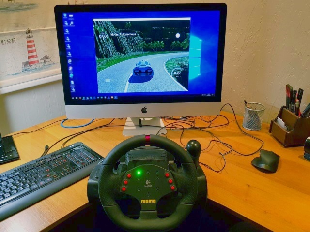

# **Behavioral Cloning**

Use end-to-end learning approach to teach convolution neural network (CNN) to drive as yourself on driving simulator.

The main goal of this project - teach car simulator dive naturally and safely on several tracks with help of convolution neural network (CNN) only. Detail description of work done is [here](./writeup_report.md).

**Project content**
* [DeepDataEngine.py](./DeepDataEngine.py) - main class for working with data. This class is used to create data storage repository and feed data to Keras training and validation processes. Data storage - is set of files, each of them can be loaded at once in memory and contain all necessary data for model training or validation. This class contains base code to create data storage from set of images and augment it based on parameters.
* [InitStorage.py](./InitStorage.py) - contains supplementary method for creation of deep storage repository from exact set of images, captured by simulator and set of parameters. Based on DeepDataEngine.py.
* model.py - containing the script to create and train the model.
* drive.py - containing the script for driving the car in autonomous mode. It's based on default version for this project, but extended for better driving behavior.
* [model.h5](./model.h5) - containing a trained convolution neural network.
* [writeup_report.md](./writeup_report.md) - project description in details.
* [video.py](./video.py) - script to create video from set of images captured by driving simulator
* [video.mp4](./video.mp4) - demonstration video from front camera of simulated car (track 1).
* [video_outer.mp4](./video_outer.mp4) - demonstration video from outside camera (track 1).
* [track2_clockwise.mp4](./track2_clockwise.mp4) - demonstration video from front camera of simulated car (track 2, clockwise).
* [track2_clockwise_outer.mp4](./track2_clockwise_outer.mp4) - demonstration video from outside camera (track 2, clockwise).
* [track2_counterclockwise.mp4](./track2_counterclockwise.mp4) - demonstration video from front camera of simulated car (track 2, counterclockwise).
* [track2_counterclockwise_outer.mp4](./track2_counterclockwise_outer.mp4) - demonstration video from outside camera (track 2, counterclockwise).
* [push_out.mp4](./push_out.mp4) - demonstration video how vehicle recovers it position on track after pushing it out in manual mode.
