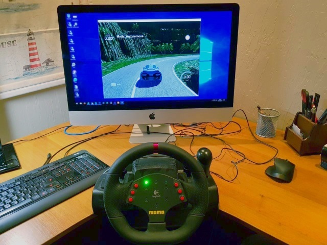
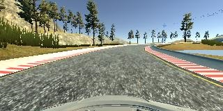

# **Behavioral Cloning**

Use end-to-end learning approach to teach convolution neural network (CNN) to drive as yourself on driving simulator.



---

**Behavioral Cloning Project**

The goals / steps of this project are the following:
* Use the simulator to collect data of good driving behavior
* Build, a convolution neural network in Keras that predicts steering angles from images
* Train and validate the model with a training and validation set
* Test that the model successfully drives around track one without leaving the road
* Summarize the results with a written report

## Rubric Points
Here I will consider the [rubric points](https://review.udacity.com/#!/rubrics/432/view) individually and describe how I addressed each point in my implementation.  

---
### Files Submitted & Code Quality

#### 1. Submission includes all required files and can be used to run the simulator in autonomous mode
My project includes the following files:
* DeepDataEngine.py - main class for working with data. This class is used to create data storage repository and feed data to Keras training and validation processes. Data storage - is set of files, each of them can be loaded at once in memory and contain all necessary data for model training or validation. This class contains base code to create data storage from set of images and augment it based on parameters.
* InitStorage.py - contains supplementary method for creation of deep storage repository from exact set of images, captured by simulator and set of parameters. Based on DeepDataEngine.py.
* model.py - containing the script to create and train the model.
* drive.py - containing the script for driving the car in autonomous mode. It's based on default version for this project, but extended for better driving behavior.
* model.h5 - containing a trained convolution neural network.
* writeup_report.md - this file, summarizing the results.
* video.py - script to create video from set of images captured by driving simulator
* [video.mp4](./video.mp4) - demonstration video from front camera of simulated car (track 1).
* [video_outer.mp4](./video_outer.mp4) - demonstration video from outside camera (track 1).
* [track2_clockwise.mp4](./track2_clockwise.mp4) - demonstration video from front camera of simulated car (track 2, clockwise).
* [track2_clockwise_outer.mp4](./track2_clockwise_outer.mp4) - demonstration video from outside camera (track 2, clockwise).
* [track2_counterclockwise.mp4](./track2_counterclockwise.mp4) - demonstration video from front camera of simulated car (track 2, counterclockwise).
* [track2_counterclockwise_outer.mp4](./track2_counterclockwise_outer.mp4) - demonstration video from outside camera (track 2, counterclockwise).
* [push_out.mp4](./push_out.mp4) - demonstration video how vehicle recovers it position on track after pushing it out in manual mode.

#### 2. Submission includes functional code
Using the Udacity provided simulator and my drive.py file, the car can be driven autonomously around the track by executing

```
python drive.py model.h5
```

Same model can be used to drive on both track 1 and track 2 in both directions.

#### 3. Submission code is usable and readable

Submitted files model.py, DeepDataEngine.py and InitStorage.py contain the code for training and saving the convolution neural network. Files include data preprocessing code and pipeline I used for training and validating the model. All files are documented with help of comments which explain what happen in code.

### Model Architecture and Training Strategy

#### 1. An appropriate model architecture has been employed

##### 1.1. Inbound data and parameters
Before starting to train neural network I investigated set of parameters available for measurement and useful for cloning driving experience:
* Inbound image - to minimize set of preprocessing steps I decided use original image in RGB format, but cropped on top and bottom to reduce set of landscape elements and focus on road only.
* Steering angle - main measure available from simulator and model will predict it. Steering angle used by model is linearly normalized by simulator to from [-25, 25] to [-1.0, 1.0].
* Speed - steering angle is not enough in complex cases. Normally, driver decrease speed before dangerous turn or steep descent or when approach to unobservable part of road. Speed is parameter which can be easy measured and predicted. In my driving model target speed is inbound parameter for cruise controller, which increase or decrease throttle value to smoothly adjust car speed to desired. Speed is linearly normalized by my data pre-processing from [0.0, 30.0] to [-0.15, 0.15].
* Throttle and break - these parameters derived from desired and current speed. It can be predicted, but not clear how to use it. So I excluded it from my model.

##### 1.2. Model structure

My model uses RGB image as inbound parameter and has 2 outbound parameters - steering angle and speed:

| Layer | Description |
|:-----:|:-----------:|
| **Input** | 160 x 320 x 3 - 3 channel RGB non-normalized image |
| Lambda | Normalize image with formula ((x / 255.0) - 0.5) * 2.0 |
| Cropping | Remove 65 pixels from image top and 25 from image bottom, result size 70 x 320 |
| **Convolution 5x5** | 1x1 stride, VALID padding, output 66 x 316 x 24 |
| ReLU |  |
| AVG pooling	2x2 | 2x2 stride, output 33 x 158 x 24 |
| **Convolution 5x5** | 1x1 stride, VALID padding, output 29 x 154 x 36 |
| ReLU |  |
| AVG pooling	2x2 | 2x2 stride, output 15 x 77 x 36 |
| **Convolution 5x5** | 1x1 stride, VALID padding, output 11 x 73 x 48 |
| ReLU |  |
| AVG pooling	2x2 | 2x2 stride, output 6 x 37 x 48 |
| **Convolution 3x3** | 1x1 stride, VALID padding, output 4 x 35 x 64 |
| ReLU |  |
| **Convolution 3x3** | 1x1 stride, VALID padding, output 2 x 33 x 64 |
| ReLU |  |
| Dropout | Probability of dropout 50% |
| **Fully connected**	| 4224 x 200 |
| ReLU |  |
| Dropout | Probability of dropout 35% |
| **Fully connected**	| 200 x 150 |
| ReLU |  |
| Dropout | Probability of dropout 25% |
| **Fully connected**	| 150 x 50 |
| ReLU |  |
| Dropout | Probability of dropout 10% |
| **Output layer** | 50 x 2 |
| Model loss | MSE (mean squared error)	|

Model was based on [NVIDIA DAVE-2 CNN](https://devblogs.nvidia.com/parallelforall/deep-learning-self-driving-cars/), but with some changes:
* Inbound image has RGB format and non-normalized. Normalization layer is included in model.
* Convolution layers with 2x2 strides was replaced by 1x1 strides followed by average-pooling after ReLU activator.
* Full layers have more parameters and dropouts between. Dropout probability depends on number of parameters in fully connected layer - more parameters, more probability of overfitting and more dropout probability.
* Output contains 2 values - normalized steering angle and normalized speed. Original model uses reverse turning radius (1/r), which more universal approach, but requires vehicle physical parameters for calculation. In test project there is only one vehicle type and steering angle already scaled to [-1.0, 1.0], so I used it in the same format without changes.

#### 2. Attempts to reduce overfitting in the model

To reduce model overfitting and make possible stay on both tracks I used next approaches:
* Model contains dropout layer after last CNN layer and after each fully-connected layer. Probability of dropout depends on number of parameters and was selected empirically - more parameters, more dropout probability.
* Whole data set was split on 2 parts - 70% training data, 30% - validation data. Model was trained with 24 epochs. Model was saved after each epoch in case validation losses decrease.
* After that some odd behavior was remain as result of overfitting. So model was "polished" - trained again on new bigger data set, but with just one epoch.
* After that model was finally tested several circles on each track in both directions.
* Model was tested with several push-out tests, where simulated car was manually pushed from track out and recovered it position.

#### 3. Model parameter tuning

The model uses Adam optimizer, so the learning rate was not tuned manually. Dropout values, size of fully-connected layers, pooling function and some other parameters was changed several times to achieve desired results.

#### 4. Appropriate training data

##### 4.1. Used equipment

To train model for right behavior it requires right examples. Using keyboard or mouse resulted in rapidly changed measures. Moreover it was not easy and natural way for car driving. So I decided use my old [Logitech MOMO racing wheel](http://support.logitech.com/en_us/product/momo-racing-force-feedback-wheel). This device has feedback on rudder, so steering angles was smooth enough. The same for speed measurement. With this training equipment and using speed measurement as second output parameter I very fast trained model for both track separately. Most significant challenge was to train one model for both tracks and avoid some odd behavior like driving by red lines on first track with excellent behavior on second track and so on.

The only problem was with this device - after installing drivers accelerator and break was split by axes and I used same pedal for acceleration and break. Actually it was not a big problem. But racing wheels support - is nice-to-have for next simulator versions.

##### 4.2. Data collection

During my training process I captured 3-7 circles for each track in each direction (clockwise and counterclockwise). Because wheel with feedback is not keyboard or mouse and I cannot jump in moment from left turn to right, I tried to drive more accurate, decrease speed in dangerous places or steep descents, take turns by bigger radius. Same habit is demonstrated by car in autonomous mode.

##### 4.3. Data augmentation

For more stable behavior in unusual cases I used information from all 3 cameras to augment primary data from central camera:
* Flipping - each image included in data set was augmented by flipped version to avoid develop non-symmetrical steering habit.
* Augmentation with shifted left/right and central camera images. Using information just from one camera and fixed correction angle can cause overfitting. In case of second narrow track it can develop undesired habits, because side cameras often simulate situation where car is located partially outside the track. So I augment data by randomly shifted images between left/right and center cameras. It's 29 possible positions in each direction. Steering angle was corrected in each case by value between 0.18 (4.5 DEG) and 0, distributed by power function 0.18 * (D ^ 1.25), where D is linear shift size in range (0, 1.0]. Measured speed is decreased by similar formula - between 100% and 75%. Total number of images augmented in this way - 30%. Increasing this number caused slowdown in learning process and negative effects like wagging.

With using this augmentation approach I avoided such odd behavior like car wagging from one lane line to other. And sure taught car retain it position on track.

### Model Architecture and Training Strategy

#### 1. Solution Design Approach

Previous chapters contains much details about model architecture design, so I just want summarize:
* I based my model on [NVIDIA DAVE-2 CNN](https://devblogs.nvidia.com/parallelforall/deep-learning-self-driving-cars/). This model already was tested in real conditions, so my assumptions was that it must suite this project needs as well. Sure, NVIDIA trained their model on 72 hours of real driving in different conditions. But I expected that it will work on much smaller data set.
* For training I used [Logitech MOMO racing wheel](http://support.logitech.com/en_us/product/momo-racing-force-feedback-wheel) to teach model on more natural and accurate driving behavior.
* I captured several data sets for each track in both directions, 3-7 circles each.
* I augmented data by flipping and shifted images from left/right cameras.
* After several experiments my base model was adjusted a bit, but main topology remained the same.
* To avoid overfitting I used dropouts with different probability after last convolution and all fully-connected layers.
* To "polish" model and remove some overfitting effects which was not avoided by using dropouts I created new bigger training set and trained model with just one epoch.
* To evaluate training process I used validation set 30% of total data set size.
* To test model I used both tracks in both directions. To pass tests car must move forward by drivable part of the track in autonomous mode and retain it position on track after manual push-out (with reasonable power).

Final tests was recorder and available with this project.

#### 2. Final Model Architecture

Final model architecture was already described, so I just copy it here:

| Layer | Description |
|:-----:|:-----------:|
| **Input** | 160 x 320 x 3 - 3 channel RGB non-normalized image |
| Lambda | Normalize image with formula ((x / 255.0) - 0.5) * 2.0 |
| Cropping | Remove 65 pixels from image top and 25 from image bottom, result size 70 x 320 |
| **Convolution 5x5** | 1x1 stride, VALID padding, output 66 x 316 x 24 |
| ReLU |  |
| AVG pooling	2x2 | 2x2 stride, output 33 x 158 x 24 |
| **Convolution 5x5** | 1x1 stride, VALID padding, output 29 x 154 x 36 |
| ReLU |  |
| AVG pooling	2x2 | 2x2 stride, output 15 x 77 x 36 |
| **Convolution 5x5** | 1x1 stride, VALID padding, output 11 x 73 x 48 |
| ReLU |  |
| AVG pooling	2x2 | 2x2 stride, output 6 x 37 x 48 |
| **Convolution 3x3** | 1x1 stride, VALID padding, output 4 x 35 x 64 |
| ReLU |  |
| **Convolution 3x3** | 1x1 stride, VALID padding, output 2 x 33 x 64 |
| ReLU |  |
| Dropout | Probability of dropout 50% |
| **Fully connected**	| 4224 x 200 |
| ReLU |  |
| Dropout | Probability of dropout 35% |
| **Fully connected**	| 200 x 150 |
| ReLU |  |
| Dropout | Probability of dropout 25% |
| **Fully connected**	| 150 x 50 |
| ReLU |  |
| Dropout | Probability of dropout 10% |
| **Output layer** | 50 x 2 |
| Model loss | MSE (mean squared error)	|

Keras visualization of this model:


Total number of parameters: **886'252**.

#### 3. Creation of the Training Set & Training Process

To capture good behavior for track 1 I tried drive in lane center. I captured several datasets in each direction with 3-7 circles each. Examples:


Automatically images from left and right cameras was recorded. I used it to train model keep vehicle in center of the lane and recover it position if it shifted left or right. Examples:


Augmented shifted image from left camera example:


Such augmentation process allows simulate position of car on different road parts and teach how to retain car position on the road. Number of augmented in this way images - 30%.

Note, that top and bottom of this image will be cropped, so disappeared right part of car is not a problem.

Augmented flipped image example:



This approach allows teach model in symmetric way. Each image in my data set has flipped pair.

Similar to track 1 I captured data from track 2. On this track I tried to keep more suitable position for driving, not just road center. For instance, I kept side with bigger radius on road turns. This behavior generalized behavior captured on track 1 and made model more universal. Examples:


Collected and augmented data set was shuffled and split on 2 parts - data set for training - 70%, validation data set - 30%.

I used validation data set in training process to save model after each epoch. In case validation losses are decreased, it was assumed that model is trained in right direction and this version can replace previous one.

To train model I used Keras with Adam optimizer and MSE validation losses. One of advantages of using this optimizer and loss function - no need tune parameters. Adaptively estimated moments in Adam optimizer helps care about that.
